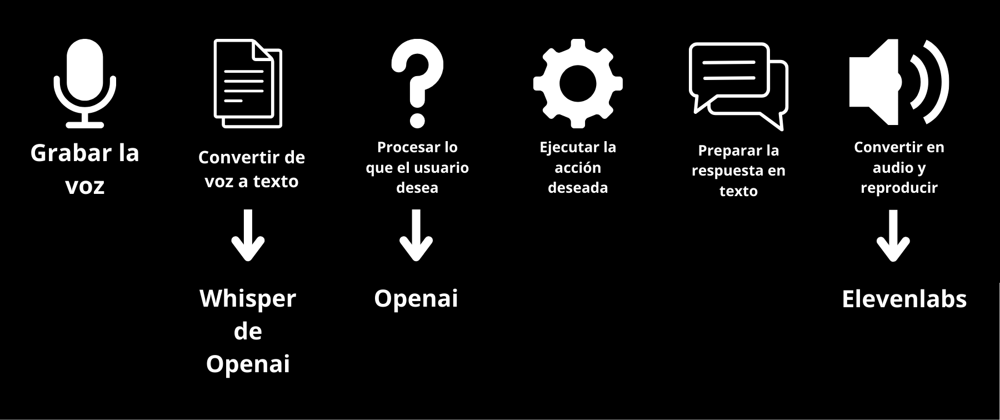

# Asistente virtual GAMA

## Como funciona?


## Justificación

El desarrollo del asistente GAMA responde a la necesidad de contar con una herramienta educativa interactiva que facilite el aprendizaje de inteligencia artificial y electrónica en la plataforma CrowPi. La CrowPi es un kit basado en Raspberry Pi que integra múltiples sensores y componentes electrónicos, lo que la hace ideal para la enseñanza de programación, electronica e internet de las cosas.

Sin embargo, la curva de aprendizaje puede ser alta para usuarios sin experiencia previa en estos campos. En este contexto, GAMA busca simplificar el proceso de aprendizaje al proporcionar un asistente basado en inteligencia artificial capaz de:

- Explicar el funcionamiento de los componentes de la CrowPi.
- Ofrecer ejemplos de código y guías interactivas.
- Responder preguntas en lenguaje natural.
- Facilitar la experimentación con proyectos de IA y hardware.

Además, este asistente potencia el aprendizaje autónomo, promoviendo un enfoque práctico y dinámico que fomente la exploración y el desarrollo de habilidades en ciencia y tecnología. Con esta solución, se busca democratizar el acceso a la educación en inteligencia artificial y electrónica, especialmente para estudiantes, docentes y entusiastas que deseen aprender de manera autodidacta o complementar su formación académica.

## Configuración
Para ejecutar el proyecto es necesario:
- Descargar el repositorio
- Opcional: Crea un ambiente virtual
- Instala las dependencias ejecutando 
	- ```  pip install -r requirements.txt ```
- Crea un archivo llamado ```.env```
	- En el archivo coloca las llaves:
	- ```OPENAI_API_KEY=XXXXXX```
	- ```ELEVENLABS_API_KEY=XXXXXX```

## Ajustes
El proyecto cuenta con algunas cosas que quizá quieras modificar, por ejemplo:

- En la clase LLM puedes modificar para que el asistente no sea "amable". Se utiliza en 2 lugares del archivo.
- En la clase PcCommand, abre Chrome buscándolo en una ruta fija para Windows. Puedes modificarlo para que busque el ejecutable en Mac / Linux.

## Ejecución
- Este proyecto utiliza Flask. Puedes levantar el servidor en modo debug por defecto en el puerto 5000 con el comando
	- ```flask --app app run --debug```
	- En tu navegador ve a http://localhost:5000
	- Da clic para comenzar a grabar (pedirá permiso). Dar clic para dejar de grabar

## Licencias
- Imagen de micrófono por Freepik
